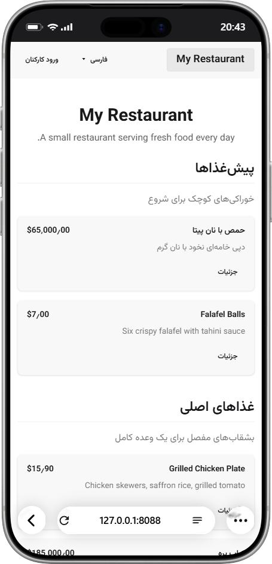

<p align="center">
  
</p>

<h1 align="center">OpenMenu</h1>

<p align="center">
  A self-hosted, single-restaurant digital menu built with .NET 10, Blazor, EF Core, PostgreSQL, Tailwind CSS and DaisyUI.
</p>

<p align="center">
  <a href="https://github.com/ParsaGachkar/OpenMenu/actions/workflows/ci.yml"></a>
  <a href="https://github.com/ParsaGachkar/OpenMenu/actions/workflows/docker.yml"></a>
  <a href="https://github.com/ParsaGachkar/OpenMenu/pkgs/container/openmenu"></a>
</p>

<p align="center">
  
</p>

## What is OpenMenu?

OpenMenu is a mobile-first digital menu you host yourself: a public menu page your guests open from a QR code on the table, and an admin area where you manage categories, menu items, photos, videos, translations and prices — in multiple languages and currencies, with no external services.

## Features

- **Public menu** (`/`) — restaurant name, description, categories, items, prices, availability. Mobile-first, responsive, themeable; one media card per item (cover photo or video).
- **Menu item detail pages** (`/menu/item/{id}`) — interactive gallery (video first, then photos) with thumbnails, per-culture name/description/price; linked from every menu card.
- **Admin area** (`/admin`) — dashboard, full CRUD for categories and menu items, restaurant settings (name, description, logo, currency, DaisyUI theme), user management (Admin only).
- **Photo galleries + set cover** — items take multiple photos; the editor gallery has a *Set cover* button that promotes any photo to the item's cover (the former cover joins the gallery).
- **Video per menu item** — uploaded to the `media` volume (never a DB blob), ≤ 50 MB, served with range processing; correct content type per extension.
- **Per-culture menu content** — every category and item can have a name/description/price override per enabled culture (data rows, not resx). The public menu and detail pages show the visitor's language with fallback to the invariant values.
- **Per-culture currency** — each translation can carry its own currency (e.g. TOMAN for Farsi, USD for English); unset means the restaurant default. Guest-friendly formatting (`$9.90`, `99,000 ریال`, `990 تومان`): symbols instead of ISO codes and whole numbers for Rial/Toman-type currencies. **Toman** is offered alongside ISO codes in Settings; the admin is responsible for entering prices in the selected unit.
- **Culture management** — pick a default culture and enable/disable the offered languages in Settings; disabled cultures are rejected by `/culture/set`.
- **Menu QR code** — `/qr/menu` renders a printable PNG of the public menu URL; shown in Settings for table tents.
- **Authentication** — cookie-based login with roles (Admin, Editor), no registration, no Identity framework.
- **Localization** — English, Farsi (فارسی), Turkish, Arabic via the standard ASP.NET Core localization stack (resx + `IStringLocalizer` + `RequestLocalization`). Right-to-left layouts are applied automatically for Farsi and Arabic. Culture links force a full document reload (`data-enhance-nav="false"`) so a running WebAssembly runtime re-reads the culture cookie.
- **Branding assets** — real favicon, Apple touch icon and PWA icons ship with the app (from the repo logo in `docs/images`).

## Stack

- .NET 10 — Blazor Web App (SSR + InteractiveAuto admin pages, WebAssembly for the client half)
- EF Core 10 + PostgreSQL (Npgsql)
- Tailwind CSS v4 + DaisyUI 5
- Cookie authentication — deliberately **no** ASP.NET Core Identity

## Project structure (Clean Architecture)

```
OpenMenu/
├── src/
│   ├── OpenMenu.Domain/           Entities + UserRole enum (no dependencies)
│   ├── OpenMenu.Application.Shared/  Reusable contracts: IAdminApi, DTOs, SupportedCultures, PriceFormatter
│   ├── OpenMenu.Application/      AdminApiServer — the IAdminApi implementation (server render path)
│   ├── OpenMenu.Infrastructure/   EF Core DbContext, migrations, password hasher, seeder
│   ├── OpenMenu.Web.Client/       Blazor client library: admin pages (InteractiveAuto), resources, WASM bootstrap
│   └── OpenMenu.Web/              Host: SSR pages, auth, localization, admin JSON APIs, media serving
├── tests/
│   ├── OpenMenu.Tests/            Unit tests (password hasher, price formatting)
│   ├── OpenMenu.ComponentTests/   bUnit component tests (real components)
│   ├── OpenMenu.IntegrationTests/ WebApplicationFactory tests for the admin JSON APIs
│   └── OpenMenu.E2ETests/         Playwright end-to-end tests (real browser)
├── docs/images/                   Logo, icons and screenshots used by this README
├── .github/workflows/ci.yml       Build + all test layers (Docker Compose)
├── .github/workflows/docker.yml   Build & publish the image to GHCR
├── docker-compose.yml
├── Dockerfile
└── README.md
```

Dependency flow: `Domain ← Application.Shared ← Application/Infrastructure/Web`; `Web.Client` depends on `Application.Shared` only.
The admin pages run InteractiveAuto: `IAdminApi` is served by `AdminApiServer` (direct DbContext, server circuits) or `AdminApiClient`
(HTTP against the admin JSON APIs, WebAssembly) — one contract, two render paths.

## Quickstart (Docker)

The published image lives on GHCR at [`ghcr.io/parsagachkar/openmenu`](https://github.com/ParsaGachkar/OpenMenu/pkgs/container/openmenu):

```bash
docker pull ghcr.io/parsagachkar/openmenu:latest
```

The container needs a PostgreSQL database. Easiest is a minimal compose file:

```yaml
services:
  db:
    image: postgres:18-alpine
    environment:
      POSTGRES_DB: openmenu
      POSTGRES_USER: postgres
      POSTGRES_PASSWORD: change-me
    volumes:
      - postgres-data:/var/lib/postgresql

  app:
    image: ghcr.io/parsagachkar/openmenu:latest
    depends_on:
      - db
    environment:
      ASPNETCORE_ENVIRONMENT: Production
      ConnectionStrings__Default: Host=db;Port=5432;Database=openmenu;Username=postgres;Password=change-me
      Seed__AdminUsername: admin
      Seed__AdminPassword: change-me-too
      Seed__DemoData: "true"
    ports:
      - "8080:8080"
    volumes:
      - app-keys:/app/keys
      - app-media:/app/media

volumes:
  postgres-data:
  app-keys:
  app-media:
```

Then `docker compose up -d` and open the menu (e.g. `http://localhost:8080`). Log in at `/login` with the seeded admin credentials.

On startup the app applies EF Core migrations and seeds the initial admin (from `Seed__AdminUsername` / `Seed__AdminPassword`) plus demo restaurant data (`Seed__DemoData=true`). Configuration uses the standard double-underscore form (`Seed__AdminPassword=…`, `APP_PORT`-style `Ports__…` not needed).

### Building from source

```bash
cp .env.example .env      # then edit POSTGRES_PASSWORD and OPENMENU_ADMIN_PASSWORD
docker compose up -d --build
```

App: http://localhost:8088 (override with `APP_PORT` in `.env`).

## Running locally

You need .NET 10 SDK, Node.js (for CSS), and a PostgreSQL instance:

```bash
# 1. CSS (Tailwind + DaisyUI)
cd src/OpenMenu.Web
npm install
npm run build:css

# 2. Run (dev seeds admin/admin123 and demo data via appsettings.Development.json)
dotnet run --project src/OpenMenu.Web
```

Connection string and seed credentials come from configuration; environment variables use the standard double-underscore form, e.g.:

```
ConnectionStrings__Default="Host=localhost;Port=5432;Database=openmenu;Username=postgres;Password=postgres"
Seed__AdminUsername=admin
Seed__AdminPassword=change-me
Seed__DemoData=true
```

## Authentication

Small, explicit, and no Identity framework:

- Passwords hashed with **PBKDF2-SHA512** (210,000 iterations, 16-byte random salt, per-call salted) via `OpenMenu.Infrastructure/Auth/PasswordHasher.cs`. Stored format: `iterations.salt.hash` (Base64). Plaintext is never stored or logged; hashes are never rendered.
- Login is a static-SSR Blazor form (`/login`) validated by `AuthService`. Unknown username, wrong password, and disabled account all return the same generic error — no user enumeration.
- Cookie auth (`OpenMenu.Auth`, HttpOnly, SameSite=Lax, 7 days). Data Protection keys persist to a mounted volume in Docker so sessions survive restarts.
- Roles come from the `UserRole` enum (Admin, Editor) and are enforced with `[Authorize(Roles = ...)]` (see table below).
- No registration. The initial admin is seeded from configuration on startup.

| Route | Access |
|---|---|
| `/` | Public |
| `/login` | Public |
| `/admin` (dashboard) | Admin, Editor |
| `/admin/menu`, `/admin/categories` | Admin, Editor |
| `/admin/settings`, `/admin/users` | Admin only |

## Localization

Implemented with the standard ASP.NET Core stack, no custom machinery:

- `AddLocalization()` + `UseRequestLocalization` with supported cultures `en`, `fa`, `tr`, `ar` (`Program.cs`).
- UI strings live in `src/OpenMenu.Web.Client/Resources/SharedResource.*.resx`.
- The header language selector is an interactive-server island that redirects through `/culture/set`, which sets the standard `.AspNetCore.Culture` cookie and bounces back to the current page (the documented redirect-based pattern).
- Validation messages are localized through `ErrorMessageResourceType`/`ErrorMessageResourceName` data annotations.
- `App.razor` sets `lang` and `dir` (RTL for `fa`/`ar`) on `<html>`; the admin-selected DaisyUI theme is applied as `data-theme`.

## Tests

```bash
# Unit tests (password hasher, price formatting)
dotnet test tests/OpenMenu.Tests

# Component tests (bUnit, real components)
dotnet test tests/OpenMenu.ComponentTests

# Integration tests (WebApplicationFactory; in-memory SQLite replaces
# PostgreSQL, so no external database is needed)
dotnet test tests/OpenMenu.IntegrationTests

# End-to-end tests (requires the app running at localhost:8088; override with OPENMENU_BASEURL,
# and a reachable PostgreSQL at localhost:5433 — both provided by `docker compose up`)
dotnet test tests/OpenMenu.E2ETests
```

The E2E suite drives a real browser (Playwright, system Chrome) through the public menu and detail pages, login/logout, role gates,
category and menu-item CRUD, the photo gallery (including the set-cover flow), video upload, settings + theme, culture switching
(including the WASM culture regressions), per-translation currency, RTL, and localized validation messages. `OPENMENU_TIMEOUT`
(seconds, default 20) raises locator/expect timeouts on slow machines.

## CI/CD

Two workflows run on every push/PR:

- **`.github/workflows/ci.yml`** — builds the solution, runs unit + bUnit tests, boots the full stack with Docker Compose, waits for the app to become healthy, runs the integration tests (admin JSON APIs, in-memory SQLite), then the Playwright E2E suite against the running app, and uploads browser test artifacts on failure.
- **`.github/workflows/docker.yml`** — builds the Docker image with Buildx (GHA cache). Pushes to `main` publish `latest` (+ `main` and full-SHA tags) to GHCR using the built-in `GITHUB_TOKEN`; version tags `v1.2.3` additionally publish `1.2.3`, `1.2`, and `1` tags. Pull requests get a build-only check — nothing is pushed. After publishing, a smoke test starts the fresh image against a disposable Postgres and checks the public menu responds.

Images are published at `ghcr.io/parsagachkar/openmenu`; the first push to `main` creates the package (public visibility can be set once in the package settings).

## Notes

- `RestaurantSettings` is enforced single-row via a database check constraint (`Id = 1`).
- EF migrations are committed (`InitialCreate`, `MenuItemTranslationCurrency`, …); migrations are applied automatically on startup.
- Category deletion cascades to its menu items (enforced in the database).
- No Redis, MinIO, RabbitMQ, multi-tenancy, or SaaS features — by design.
